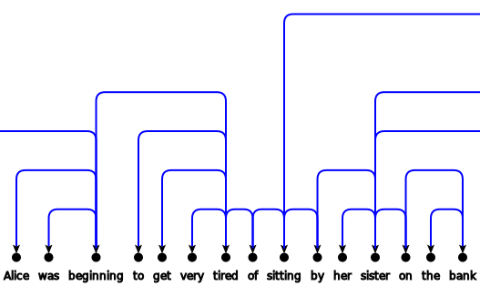

# d3-arcdiagram

[Arc Diagram](http://en.wikipedia.org/wiki/Arc_diagram) layout for D3
(<http://d3js.org>)



Examples:

* http://bl.ocks.org/goodmami/fd03b250588e1e1143bd
* http://bl.ocks.org/goodmami/41d4ecc7520b73c21538

## API

<a name="d3_arcDiagram" href="#d3_arcDiagram">#</a> d3.<b>arcDiagram</b>()

Create a new arc diagram layout with the default configuration.

The layout is a function that computes node and edge positioning based on
bound data, and can be configured with the following functions. After
configuring, run the layout function to compute node and link position data.

<a name="arcDiagram_nodes" href="arcDiagram_nodes">#</a> arcDiagram.<b>nodes</b>(nodes)

Bind the `nodes` argument as the node data for the layout. There is no
required data, but calling the layout function will compute `x`, `y`, and
`index` members.

<a name="arcDiagram_links" href="arcDiagram_links">#</a> arcDiagram.<b>links</b>(links)

Bind the `links` argument as the link data for the layout. `links` is a list
of objects with `source` and `target` members that specify the indices of the
nodes that are linked. Calling the layout function will compute the `x1`,
`x2`, `distance`, `level`, and `height` members.

<a name="arcDiagram_sortNodes" href="arcDiagram_sortNodes">#</a> arcDiagram.<b>sortNodes</b>(compareFunction)

Sort the nodes based on `compareFunction`, which takes the `nodes` array as an
argument. The `source` and `target` indices in the `links` data will be
updated as necessary. Sorting occurs before the `x` or `y` members have been
set.

<a name="arcDiagram_sortLinks" href="arcDiagram_sortLinks">#</a> arcDiagram.<b>sortLinks</b>(compareFunction)

Sort the links based on `compareFunction`, which takes the `links` array as an
argument. Sorting occurs after `distance` has been calculated, but before
`x1`, `x2`, `level`, or `height`.

<a name="arcDiagram_linkLevel" href="arcDiagram_linkLevel">#</a> arcDiagram.<b>linkLevel</b>(level)

Set the method for computing the height of links. The `level` argument is a
function that takes two parameters: `link` and `levelIndex`. For convenience,
`level` can be the string `"compact"`, which computes the minimum height
required to avoid overlapping levels between nodes (works well with orthogonal
paths), or `"distance"`, which computes the height based on the distance
between the nodes (works well with curved arcs).

<a name="arcDiagram_nodeWidth" href="arcDiagram_nodeWidth">#</a> arcDiagram.<b>nodeWidth</b>(width)

Set the width of a node. The `width` argument can be an number, which is a
constant width for all nodes, or a function that takes a `node` parameter,
which can be used to calculate custom widths per node.

<a name="arcDiagram_separation" href="arcDiagram_separation">#</a> arcDiagram.<b>separation</b>(sep)

Set the separation distance between nodes. The `sep` argument can be a number,
which is a constant separation between all nodes, or a function that can
compute a custom separation given a `node` argument.

<a name="arcDiagram_nodeXOffset" href="arcDiagram_nodeXOffset">#</a> arcDiagram.<b>nodeXOffset</b>(offset)

Set the x-offset of a node from the current x position on the layout. The
`offset` argument can be a constant number or a function with a `node`
parameter. This is useful for nodes with non-constant width (e.g. horizontal
text labels), as in the following, which sets the x position to the center
of a node considering its width:

```javascript
var arcd = d3.arcDiagram()
    .nodeWidth(function(d) { return d.width; })
    .separation(10)
    .nodeXOffset(function(d) { return d.width/2; });
```

<a name="arcDiagram_levelHeight" href="arcDiagram_levelHeight">#</a> arcDiagram.<b>levelHeight</b>(height)

Set the height of each level. The `height` can be a constant number, or a
function that takes a `link` argument. The default is to return the `level`
member of each link (see [arcDiagram.linkLevel](#arcDiagram_linkLevel)), but
this function is useful for scaling the height based on the calculated level.
